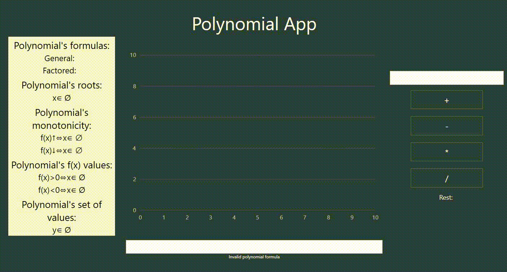
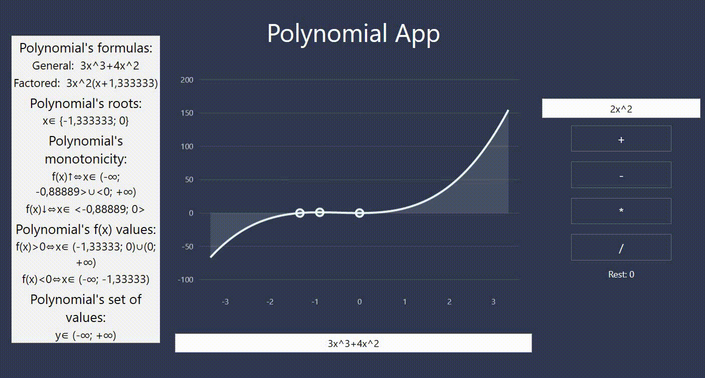

# PolynomialApp

### Aplication that allows user to get properties of polynomial, visual interpretation of it and to do mathemtical operations on two polynomials

____
## How does it work?

### Input polynomial

### See properties and graph of your polynomial

### Do arithmetic operations (add, subtract, multiply and devide by second polynomia)

